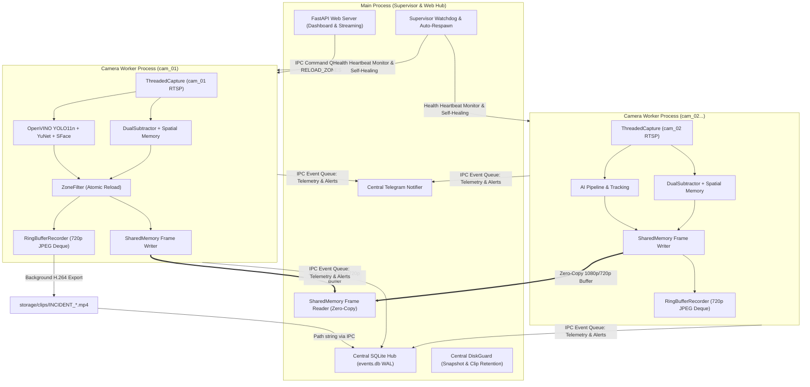

# Cetak Biru & Peta Jalan: Arsitektur Multi-Process VMS (Enterprise Scaling)

> **Status Dokumen**: Roadmap / Peta Jalan Masa Depan (Ditunda untuk implementasi fase ekspansi multi-kamera).  
> **Fokus Saat Ini (`v2`)**: Stabilitas maksimal, presisi inferensi, dan keandalan operasional pada 1 kamera utama (`cam_01`).  
> **Target Penggunaan**: Digunakan sebagai acuan teknis saat skala sistem diperluas menjadi 4–8+ channel CCTV RTSP simultan.

---

## 1. Latar Belakang & Tujuan Arsitektur

Pada pipeline single-process (`v2`), seluruh beban komputasi—mulai dari dekode RTSP, inferensi AI YOLO11n OpenVINO, DualSubtractor MOG2, pengenalan biometrik YuNet + SFace, hingga server web FastAPI/Uvicorn—berjalan di bawah satu proses Python tunggal.

Meskipun arsitektur single-process saat ini sangat efisien dan stabil untuk 1 kamera, skalabilitas ke banyak kamera (4–8 channel 1080p) akan menghadapi limitasi:
1. **Python Global Interpreter Lock (GIL)**: Thread komputasi AI bersaing memperebutkan satu GIL Python, menurunkan throughput FPS.
2. **Isolasi Kegagalan (Fault Isolation)**: Jika satu RTSP stream mengalami network freeze atau driver crash, proses lain tidak boleh terpengaruh.
3. **Core Pinning & CPU Affinity**: Multi-process memungkinkan setiap worker kamera dialokasikan ke core CPU tertentu secara seimbang.

---

## 2. Diagram Alur Arsitektur (Mermaid Blueprint)



---

## 3. Lima Pilar Keputusan Desain (Disepakati Melalui Sesi Grill-Me)

### Pilar 1: Hybrid SharedMemory + IPC Queue (Zero-Copy Stream)
- **Visual Display Frame**:
  - Menggunakan `multiprocessing.shared_memory.SharedMemory` berukuran tetap untuk setiap kamera (misal `1920x1080x3` = ~6.2 MB buffer).
  - Worker kamera menulis frame display langsung ke memory block (`np.ndarray` wrapper atas shm buffer).
  - Web server membaca frame secara *zero-copy* dengan latensi $< 1$ ms tanpa beban serialisasi/deserialisasi (*pickle overhead* bernilai nol).
- **Telemetri & Status**:
  - Dikirim melalui `multiprocessing.Queue(maxsize=10)` yang ringan berisi payload JSON/dict (FPS, jumlah pelanggaran, status RTSP, objek aktif).

### Pilar 2: Centralized Event & Notification Hub di Main Process
- **Pencegahan Database Locking**:
  - Worker **dilarang** membuka koneksi tulis ke SQLite `storage/events.db` secara langsung.
  - Worker hanya mengirim event message via Queue:
    ```python
    {
        "type": "VIOLATION_TRIGGERED",
        "camera_id": "cam_01",
        "zone_id": "zone_2_transit",
        "track_id": 1,
        "dwell_duration": 3600.0,
        "composite_path": "cameras/cam_01/snapshots/COMPOSITE_....jpg",
        "owner_name": "Budi Santoso",
        "owner_confidence": 0.88,
        "clip_path": "storage/clips/INCIDENT_....mp4"
    }
    ```
  - Main Process memiliki satu dedicated thread database writer yang mengeksekusi `log_event()` atau `resolve_event()`, menjamin zero lock collision.
- **Sentralisasi Notifikasi & DiskGuard**:
  - `TelegramNotifier` dan `DiskGuardWorker` hanya berjalan 1 instans di Main Process untuk mengelola rate-limit global dan pembersihan disk FIFO secara terpadu.

### Pilar 3: Control Command Queue untuk Hot-Reload Zona ROI
- Saat operator mengedit dan menyimpan poligon zona di Web Dashboard:
  1. Web server memvalidasi geometri dan memperbarui `cameras/<cam_id>/roi_zones.json` serta backup `.bak`.
  2. Main Process mengirimkan pesan kontrol ke worker antrean perintah:
     ```python
     cmd_queue.put({"cmd": "RELOAD_ZONES", "camera_id": "cam_01"})
     ```
  3. Worker memeriksa `cmd_queue.get_nowait()` di awal loop frame. Saat menerima perintah, worker memanggil `pipeline.reload_zones()` dan membalas status acknowledge.
  4. Tidak ada restart proses, streaming tetap berjalan lancar tanpa jeda.

### Pilar 4: Supervisor Watchdog & Auto Self-Healing
- **Heartbeat Monitoring**:
  - Setiap worker memperbarui timestamp `last_heartbeat = time.time()` pada shared atomic value setiap frame berhasil diproses.
- **Deteksi & Pemulihan**:
  - Supervisor thread di Main Process memeriksa seluruh worker setiap 2.0 detik.
  - Jika `worker.is_alive() == False` atau `now - last_heartbeat > 10.0` detik:
    * Supervisor mencatat alert log critical.
    * Memutus paksa proses zombie (`terminate()`).
    * Membersihkan handle `SharedMemory` lama.
    * Me-respawn proses worker baru secara otomatis.

### Pilar 5: Worker-Local Background DVR Export
- **Efisiensi Ekspor H.264**:
  - Circular Ring Buffer (250 frame JPEG 720p) tetap hidup di private memory milik proses worker (~15–25 MB).
  - Saat Stage 3 Breach tercapai, encoding video H.264 (`avc1`) dijalankan di `ThreadPoolExecutor` lokal milik worker tersebut.
  - Menghindari pemindahan ratusan frame mentah melintasi IPC process boundary.
  - Setelah file `.mp4` selesai ditulis ke `storage/clips/`, worker hanya mengirimkan string path file klip ke Main Process.

---

## 4. Tahapan Rencana Migrasi (Execution Plan) Saat Multi-Kamera Diaktifkan

| Fase | Komponen | Deskripsi Pekerjaan |
|---|---|---|
| **Fase 1** | `engine/ipc_shared_mem.py` | Implementasi kelas pembungkus `SharedMemoryFrame` (double-buffering read/write flag, auto-unlink). |
| **Fase 2** | `engine/camera_worker.py` | Refaktor `CameraPipeline` agar dapat dijalankan sebagai target fungsi `multiprocessing.Process`. |
| **Fase 3** | `engine/supervisor.py` | Pembuatan loop pengawas proses (*watchdog*), pemantau heartbeat, dan auto-respawn logic. |
| **Fase 4** | `web/server.py` | Menghubungkan endpoint stream MJPEG ke pembaca `SharedMemory` alih-alih memory pipeline lokal. |
| **Fase 5** | `tools/test_multiprocess_scaling.py` | Pengujian simulasi 4 kamera simultan, stress-test auto-respawn saat worker di-kill paksa, dan validasi zero-lock DB. |

---

## 5. Ringkasan Estimasi Resource Per Kamera

| Metrik | Single-Process (`v2` Saat Ini) | Multi-Process (Roadmap Nanti) |
|---|---|---|
| **Kapasitas CPU** | 1 Core terbagi dengan GIL | 1 Core independen per kamera (OpenVINO OpenMP thread) |
| **RAM per Kamera** | ~180 MB (YOLO + Subtractor + Deque) | ~200 MB (+ ~6 MB SharedMemory display) |
| **Throughput Inferensi** | 10–13 FPS (1 Cam) / 5–7 FPS (jika dipaksa 4 Cam) | 12–15 FPS stabil di tiap kamera independen |
| **Kestabilan Driver RTSP** | Crash satu stream berisiko mematikan aplikasi | Terisolasi penuh (stream lain tetap berjalan 100%) |

---
*Dokumen ini disimpan sebagai referensi teknis resmi proyek Smart CCTV 2.0 Enterprise.*
